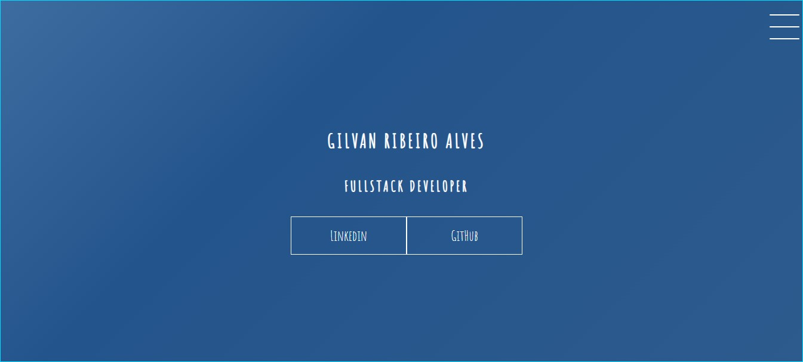
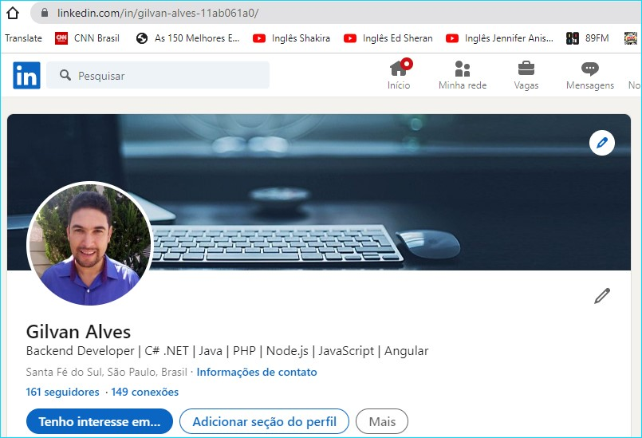
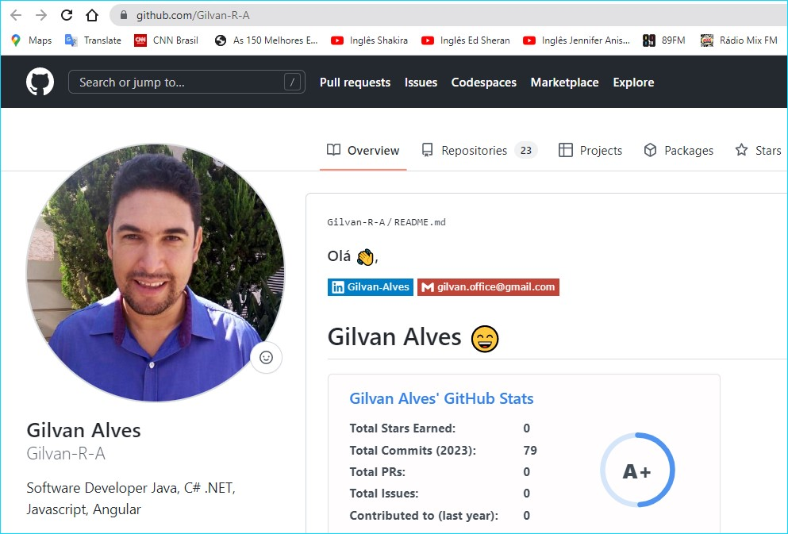
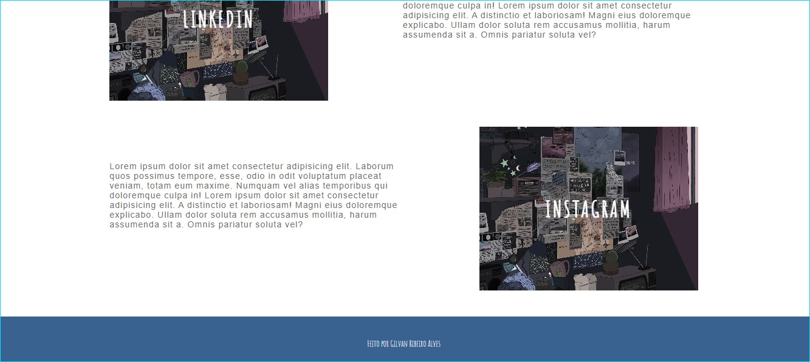

# Transitions_CSS

Esse projeto foi desenvolvido em HTML e CSS com a tutoria da Gabriela Pinheiro da Digital Innovation One.  
Nele foram explorados conceitos CSS como pseudo elementos, pseudo classes e recursos de animação como transitions.   
Foi criado um portifólio com:   
## Página Inicial

   
Com acesso a:   

## Perfil do Linkedin

   

## Perfil do GitHub

   

Ele também tem:   

## Menu Hamburguer

   

## Corpo da página e footer

